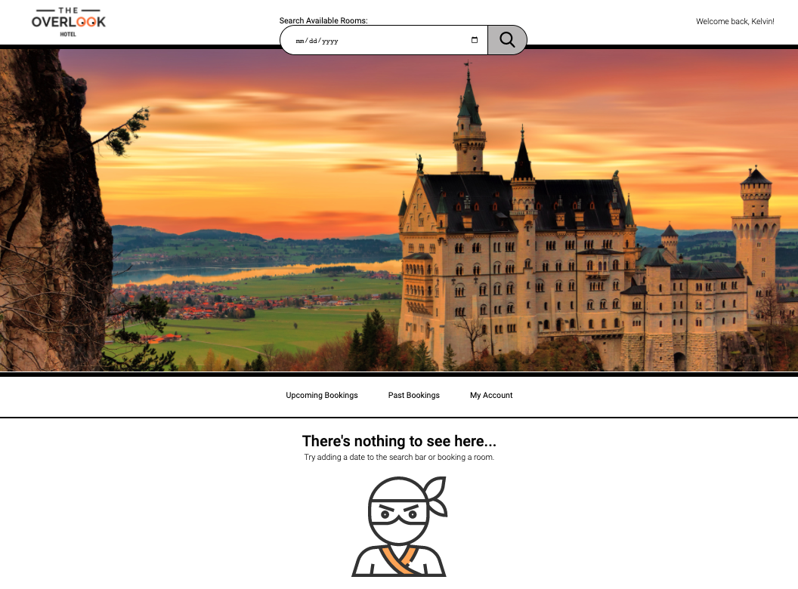

# Overlook Hotel Booker

## Table of Contents

- [About the Project](#about-the-project)
  - [Final Product](#final-product)
- [Project Goals](#project-goals)
- [Installation](#installation)
- [Technologies Used](#technologies-used)
- [Functionality](#functionality)
  - [General](#general)
  - [Error Handling](#error-handling)
  - [Mobile View](#mobile-view)
  - [Tablet View](#tablet-view)
  - [Accessibility](#accessibility)
- [Contributors](#contributors)
- [Contact](#contact)

## About the Project

In this project, our job was to take code that was written by another student and transform it into a beautiful, functional application. 

Project spec ->
https://frontend.turing.io/projects/overlook.html

#### Final Product:

## Project Goals 
1. Make network requests to API endpoints to retrieve and manipulate data.
2. Use Object Oriented Programming (OOP) to drive the design of the application and the code.
3. Create a robust test suite that thoroughly tests all functionality of a client-side application.
4. Ensure the app is following best accessibility practices.
5. Leverage Sass to DRY up CSS.
6. Incorporate Webpack to streamline the workflow process.
7. Make the app responsive so that content can be viewed on all devices.

## Installation
View the code -> 
https://github.com/aemiers/booker

To view the site ->

Clone down the local server
https://github.com/turingschool-examples/overlook-api

Then run
`npm install`
`npm start`

Clone down the repo to your local machine ->
https://github.com/aemiers/booker

Then run
`npm install`
`npm start`

Go to http://localhost:8080/ to view the website.

## Technologies Used

- 

- 

- 

- 

- 

- 

## Functionality

#### General
Overlook Hotel Booker is a versatile web application that enables its users to book hotel rooms, view their upcoming and past reservations, and see their billing history. If a user desires to book a hotel room for a specific date, the available rooms will be filtered and only show the customer rooms that have not been booked for their choice date. The customer can also view their upcoming reservations, which are sorted by date. The past reservations tab displays reservations from the most recent stays on back, making it convient for the customer to locate their desired stay. 

#### Error Handling
Error handling was considered when building the website. The date category must be completed before the search submit button is activated. 

The customer can only book future stays because all of the past dates on the calendar are deactivated.

If there are no rooms available or if the customer has not picked a date, the empty state ninja makes an appearance, prompting the user in the right direction.

#### Responsiveness
##### Mobile View

##### Tablet View

#### Accessibility
Overlook Hotel Booker scores very highly on Wave and received a 100% from Lighthouse on Accessibility.. Users can tab throughout the full application, making it accessible for those using keyboards to navigate through. 

## Contributers
* [Anneke Miers](https://github.com/aemiers)

## Contact
[][linkedin2]
[][github2]

<!-- Personal Definitions  -->
[linkedin2]: https://www.linkedin.com/in/anneke-miers/
[github2]: https://github.com/aemiers
